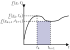

= Solver
:sectnumlevels: 5
:toc: left
:toc-title: Contents
:toclevels: 5
:stem: latexmath
:nofooter:

.Mathematical notation
[cols="1,7",options="header"]
|====
|Notation
|Description

^|latexmath:[\underline{A}]
|Matrix

^|latexmath:[\underline{x}]
|Vector

^|latexmath:[\underline{A}^{-1}]
|Inverse of Matrix latexmath:[\underline{A}]

^|latexmath:[\underline{A}^+]
|Moore-Penrose-Pseudoinverse of Matrix latexmath:[\underline{A}]

^|latexmath:[\underline{f}(...)]
|Vector-Function

^|latexmath:[\frac{\partial \underline{f}(\underline{x})}{\partial \underline{x}}]
|Partial-Derivitative of Vector-Function latexmath:[\underline{f}(...)]

^|latexmath:[\mathbb{N}]
|Natural numbers

|====

.Symbols
[cols="1,7",options="header"]
|====
|Symbol
|Description

^|latexmath:[\underline{x}]
|State vector

^|latexmath:[\underline{J}]
|Jacobian-Matrix

^|latexmath:[\underline{I}]
|Unit-Matrix

^|latexmath:[h]
|Step size

^|latexmath:[t]
|Time

|====

.Subscripts
[cols="1,7",options="header"]
|====
|Subscript
|Description

^|latexmath:[k]
|Step index

^|latexmath:[i]
|Iteration index

^|latexmath:[n]
|Vector element index

|====

== Test system
In order to evaluate the integration algorithms and compare them to other implementations, a test system is used. The Lotka-Voltera-Equation is a well known equation used to describe the population growth of two species. The two species interact as predator and prey.

[stem]
++++
\underline{\dot{x}} = 
\begin{bmatrix}
\dot{x}_1 \\
\dot{x}_2 \\
\end{bmatrix} =
\begin{bmatrix}
x_1 \cdot \left(\alpha - \beta \cdot x_2\right) \\
x_2 \cdot \left(\delta \cdot x_1 - \gamma\right) \\
\end{bmatrix}
++++

.Paramter explanation
[cols="1,1,6",options="header"]
|====
|Parameter
|Value
| Description

^|latexmath:[\alpha]
|latexmath:[0.1]
|Prey's growth rate

^|latexmath:[\beta]
|latexmath:[0.02]
|Prey's death rate per predator

^|latexmath:[\gamma]
|latexmath:[0.4]
|Predator's death rate

^|latexmath:[\delta]
|latexmath:[0.02]
|Predator's growth rate per prey

^|latexmath:[x_1(t_0)]
|latexmath:[10]
|Prey's population density at time latexmath:[t_0]

^|latexmath:[x_2(t_0)]
|latexmath:[10]
|Predator's population density at time latexmath:[t_0]

|====

From mathematics perspective this differential equation is categorized as

* ordinary (ode)
* first order
* non-linear
* continuos
* homogenous
* constant parameters

== Explicit, Fixed step solver

=== Ode1, Euler
This solver is also known as "Explicit-Euler", "Forward-Euler" or "Rectangular-Forward-Integration". As shown in the figure below, the integration assumes latexmath:[\underline{f}(\underline{x}_k, t_k)] to be constant in the interval from latexmath:[t_k] to latexmath:[t_{k+1}] and therefor "forward" integrates this functions value to yield the state latexmath:[\underline{x}_{k+1}] in the next time step latexmath:[t_{k+1}]. Geometrically, the integrator adds the blue "rectangular" area to the current state latexmath:[\underline{x}_k] to yield the next state latexmath:[\underline{x}_{k+1}].

.Euler-Integration

[stem]
++++
\begin{aligned}
\underline{k}_1 &= \underline{f}\left(\underline{x}_k, t_k\right)\\
\underline{x}_{k+1} &= \underline{x}_{k} + h \cdot \underline{k}_1\\
t_{k+1} &= t_k + h
\end{aligned}
++++

=== Ode2, Heun
This solver assumes the state latexmath:[\underline{x}] to change linear in the interval from latexmath:[t_k] to latexmath:[t_{k+1}]. Geometrically, the integrator adds the blue "trapezoid" area to the current state latexmath:[\underline{x}_k] to yield the next state latexmath:[\underline{x}_{k+1}].

.Heun-Integration

The area formula for a trapezoid yields the following integration formula.
[stem]
++++
\underline{x}_{k+1} = \underline{x}_{k} + \frac{1}{2} \cdot h \cdot \left(\underline{f}\left(\underline{x}_k, t_k\right) + \underline{f}\left(\underline{x}_{k+1}, t_{k+1}\right)\right)
++++

The resulting equation is implicit. Using the ode1 equation however provides an estimate for latexmath:[\underline{x}_{k+1}]. The resulting integration formula below is therefor explicit.

[stem]
++++
\begin{aligned}
\underline{k}_1 &= \underline{f}\left(\underline{x}_k, t_k\right)\\
\underline{k}_2 &= \underline{f}\left(\underline{x}_k + h \cdot \underline{k}_1, t_k + h\right)\\
\underline{x}_{k+1} &= \underline{x}_{k} + \frac{1}{2} \cdot h \cdot \left(\underline{k}_1 + \underline{k}_2\right)\\
t_{k+1} &= t_k + h
\end{aligned}
++++

=== Ode3, Bogacki–Shampine
#TODO: How are these parameters derived?#

[stem]
++++
\begin{aligned}
\underline{k}_1 &= \underline{f}\left(\underline{x}_k, t_k\right)\\
\underline{k}_2 &= \underline{f}\left(\underline{x}_k + \frac{1}{2} \cdot h \cdot \underline{k}_1, t_k + \frac{1}{2} \cdot h\right)\\
\underline{k}_3 &= \underline{f}\left(\underline{x}_k + \frac{3}{4} \cdot h \cdot \underline{k}_2, t_k + \frac{3}{4} \cdot h\right)\\
\underline{x}_{k+1} &= \underline{x}_{k} + h \cdot \left(\frac{2}{9} \cdot \underline{k}_1 + \frac{1}{3} \cdot \underline{k}_2 + \frac{4}{9} \cdot \underline{k}_3\right)\\
t_{k+1} &= t_k + h
\end{aligned}
++++

=== Ode4, Runge-Kutta
#TODO: How are these parameters derived?#

[stem]
++++
\begin{aligned}
\underline{k}_1 &= \underline{f}\left(\underline{x}_k, t_k\right)\\
\underline{k}_2 &= \underline{f}\left(\underline{x}_k + \frac{1}{2} \cdot h \cdot \underline{k}_1, t_k + \frac{1}{2} \cdot h\right)\\
\underline{k}_3 &= \underline{f}\left(\underline{x}_k + \frac{1}{2} \cdot h \cdot \underline{k}_2, t_k + \frac{1}{2} \cdot h\right)\\
\underline{k}_4 &= \underline{f}\left(\underline{x}_k + h \cdot \underline{k}_3, t_k + h\right)\\
\underline{x}_{k+1} &= \underline{x}_{k} + \frac{1}{6} \cdot h \cdot \left(\underline{k}_1 + 2 \cdot \underline{k}_2 + 2 \cdot \underline{k}_3 + \underline{k}_4\right)\\
t_{k+1} &= t_k + h
\end{aligned}
++++

=== Ode5, Dormand-Prince
#TODO: How are these parameters derived?#

[stem]
++++
\begin{aligned}
\underline{k}_1 &= \underline{f}\left(\underline{x}_k, t_k\right)\\
\underline{k}_2 &= \underline{f}\left(\underline{x}_k + \frac{1}{5} \cdot h \cdot \underline{k}_1, t_k + \frac{1}{5} \cdot h\right)\\
\underline{k}_3 &= \underline{f}\left(\underline{x}_k + \frac{3}{40} \cdot h \cdot \underline{k}_1 + \frac{9}{40} \cdot h \cdot \underline{k}_2, t_k + \frac{3}{10} \cdot h\right)\\
\underline{k}_4 &= \underline{f}\left(\underline{x}_k + \frac{44}{45} \cdot h \cdot \underline{k}_1 - \frac{56}{15} \cdot h \cdot \underline{k}_2 + \frac{32}{9} \cdot h \cdot \underline{k}_3, t_k + \frac{8}{10} \cdot h\right)\\
\underline{k}_5 &= \underline{f}\left(\underline{x}_k + \frac{19372}{6561} \cdot h \cdot \underline{k}_1 - \frac{25360}{2187} \cdot h \cdot \underline{k}_2 + \frac{64448}{6561} \cdot h \cdot \underline{k}_3 - \frac{212}{729} \cdot h \cdot \underline{k}_4, t_k + \frac{8}{9} \cdot h\right)\\
\underline{k}_6 &= \underline{f}\left(\underline{x}_k + \frac{9017}{3168} \cdot h \cdot \underline{k}_1 - \frac{355}{33} \cdot h \cdot \underline{k}_2 + \frac{46732}{5247} \cdot h \cdot \underline{k}_3 + \frac{49}{176} \cdot h \cdot \underline{k}_4 - \frac{5103}{18656} \cdot h \cdot \underline{k}_4, t_k + h\right)\\
\underline{x}_{k+1} &= \underline{x}_{k} + h \cdot \left(\frac{35}{384} \cdot \underline{k}_1 + \frac{500}{1113} \cdot \underline{k}_3 + \frac{125}{192} \cdot \underline{k}_4 + \frac{2187}{6784} \cdot \underline{k}_5 + + \frac{11}{84} \cdot \underline{k}_6\right)\\
t_{k+1} &= t_k + h
\end{aligned}
++++

=== Ode8, Dormand-Prince
#TODO: How are these parameters derived?#

[stem]
++++
\begin{aligned}
\underline{k}_1 &= \underline{f}\left(\underline{x}_k, t_k\right)\\
\underline{k}_2 &= \underline{f}\left(\underline{x}_k + \frac{1}{18} \cdot h \cdot \underline{k}_1, t_k + \frac{1}{18} \cdot h\right)\\
\underline{k}_3 &= \underline{f}\left(\underline{x}_k + \frac{1}{48} \cdot h \cdot \underline{k}_1 + \frac{1}{16} \cdot h \cdot \underline{k}_2, t_k + \frac{1}{12} \cdot h\right)\\
\underline{k}_4 &= \underline{f}\left(\underline{x}_k + \frac{1}{32} \cdot h \cdot \underline{k}_1 + \frac{3}{32} \cdot h \cdot \underline{k}_3, t_k + \frac{1}{8} \cdot h\right)\\
\underline{k}_5 &= \underline{f}\left(\underline{x}_k + \frac{5}{16} \cdot h \cdot \underline{k}_1 - \frac{75}{64} \cdot h \cdot \underline{k}_3 + \frac{75}{64} \cdot h \cdot \underline{k}_4, t_k + \frac{5}{16} \cdot h\right)\\
\underline{k}_6 &= \underline{f}\left(\underline{x}_k + \frac{3}{80} \cdot h \cdot\underline{k}_1 + \frac{3}{16} \cdot h \cdot\underline{k}_4 + \frac{3}{20} \cdot h \cdot\underline{k}_5, t_k + \frac{3}{8} \cdot h\right)\\
\underline{k}_7 &= \underline{f}\left(\underline{x}_k + \frac{29443841}{614563906} \cdot h \cdot \underline{k}_1 + \frac{77736538}{692538347} \cdot h \cdot \underline{k}_4 - \frac{28693883}{1125000000} \cdot h \cdot\underline{k}_5 + \frac{23124283}{1800000000} \cdot h \cdot\underline{k}_6, t_k + \frac{59}{400} \cdot h\right)\\
\underline{k}_8 &= \underline{f}\left(\underline{x}_k + \frac{16016141}{946692911}\cdot h \cdot\underline{k}_1 + \frac{61564180}{158732637} \cdot h \cdot\underline{k}_4 + \frac{22789713}{633445777} \cdot h \cdot\underline{k}_5 + \frac{545815736}{2771057229} \cdot h \cdot\underline{k}_6 - \frac{180193667}{1043307555} \cdot h \cdot\underline{k}_7, t_k + \frac{93}{200} \cdot h\right)\\
\underline{k}_9 &= \underline{f}\left(\underline{x}_k + \frac{39632708}{573591083} \cdot h \cdot\underline{k}_1 - \frac{433636366}{683701615} \cdot h \cdot\underline{k}_4 - \frac{421739975}{2616292301} \cdot h \cdot\underline{k}_5 + \frac{100302831}{723423059} \cdot h \cdot\underline{k}_6 + \frac{790204164}{839813087} \cdot h \cdot\underline{k}_7 + \frac{800635310}{3783071287} \cdot h \cdot\underline{k}_8, t_k + \frac{5490023248}{9719169821} \cdot h\right)\\
\underline{k}_{10} &= \underline{f}\left(\underline{x}_k + \frac{246121993}{1340847787} \cdot h \cdot\underline{k}_1 - \frac{37695042795}{15268766246} \cdot h \cdot\underline{k}_4 - \frac{309121744}{1061227803} \cdot h \cdot\underline{k}_5 - \frac{12992083}{490766935}  \cdot h \cdot\underline{k}_6 + \frac{6005943493}{2108947869}  \cdot h \cdot\underline{k}_7 + \frac{393006217}{1396673457} \cdot h \cdot\underline{k}_8 + \frac{123872331}{1001029789} \cdot h \cdot\underline{k}_9, t_k + \frac{13}{20} \cdot h\right)\\
\underline{k}_{11} &= \underline{f}\left(\underline{x}_k - \frac{1028468189}{846180014} \cdot h \cdot\underline{k}_1 + \frac{8478235783}{508512852} \cdot h \cdot\underline{k}_4 + \frac{1311729495}{1432422823} \cdot h \cdot\underline{k}_5 - \frac{10304129995}{1701304382} \cdot h \cdot\underline{k}_6 - \frac{48777925059}{3047939560} \cdot h \cdot\underline{k}_7 + \frac{15336726248}{1032824649} \cdot h \cdot\underline{k}_8 - \frac{45442868181}{3398467696} \cdot h \cdot\underline{k}_9 + \frac{3065993473}{597172653}  \cdot h \cdot\underline{k}_{10}, t_k + \frac{1201146811}{1299019798} \cdot h\right)\\
\underline{k}_{12} &= \underline{f}\left(\underline{x}_k + \frac{185892177}{718116043} \cdot h \cdot\underline{k}_1 - \frac{3185094517}{667107341} \cdot h \cdot\underline{k}_4 - \frac{477755414}{1098053517} \cdot h \cdot\underline{k}_5 - \frac{703635378}{230739211} \cdot h \cdot\underline{k}_6 + \frac{5731566787}{1027545527} \cdot h \cdot\underline{k}_7 + \frac{5232866602}{850066563} \cdot h \cdot\underline{k}_8 - \frac{4093664535}{808688257} \cdot h \cdot\underline{k}_9 + \frac{3962137247}{1805957418} \cdot h \cdot\underline{k}_{10} + \frac{65686358}{487910083} \cdot h \cdot\underline{k}_{11}, t_k + h\right)\\
\underline{k}_{13} &= \underline{f}\left(\underline{x}_k + \frac{403863854}{491063109} \cdot h \cdot\underline{k}_1 - \frac{5068492393}{434740067} \cdot h \cdot\underline{k}_4 - \frac{411421997}{543043805} \cdot h \cdot\underline{k}_5 + \frac{652783627}{914296604} \cdot h \cdot\underline{k}_6 + \frac{11173962825}{925320556} \cdot h \cdot\underline{k}_7 - \frac{13158990841}{6184727034} \cdot h \cdot\underline{k}_8 + \frac{3936647629}{1978049680} \cdot h \cdot\underline{k}_9 - \frac{160528059}{685178525} \cdot h \cdot\underline{k}_{10} + \frac{248638103}{1413531060} \cdot h \cdot\underline{k}_{11}, t_k + h\right)\\
\underline{x}_{k+1} &= \underline{x}_{k} + h \cdot \left(\frac{14005451}{335480064} \cdot\underline{k}_1 - \frac{59238493}{1068277825} \cdot\underline{k}_6 + \frac{181606767}{758867731} \cdot\underline{k}_7 + \frac{561292985}{797845732} \cdot\underline{k}_8 - \frac{1041891430}{1371343529} \cdot\underline{k}_9 + \frac{760417239}{1151165299} \cdot\underline{k}_{10} + \frac{118820643}{751138087} \cdot\underline{k}_{11} - \frac{528747749}{2220607170} \cdot\underline{k}_{12} + \frac{1}{4} \cdot\underline{k}_{13}\right)\\
t_{k+1} &= t_k + h
\end{aligned}
++++

== Implicit, Fixed step solver

=== Ode1be, Backward-Euler
Similar to the "Forward-Euler", the "Backward-Euler" approximates the integration using rectangles, but in contrast the "Backward-Euler" evaluates the ode at latexmath:[\underline{f}\left(\underline{x}_{k+1}, t_{k+1}\right)] rather than the "Forward-Euler" which evaluates the ode at latexmath:[\underline{f}\left(\underline{x}_{k}, t_{k}\right)].

.Backward-Euler-Integration

Defining the integration this way, results in an implicit integration formula.

[stem]
++++
\begin{aligned}
\underline{k}_1 &= \underline{f}\left(\underline{x}_{k+1}, t_{k+1}\right)\\
\underline{x}_{k+1} &= \underline{x}_{k} + h \cdot \underline{k}_1\\
t_{k+1} &= t_k + h
\end{aligned}
++++

Substituting yields the following equation.

[stem]
++++
\underline{x}_{k+1} = \underline{x}_{k} + h \cdot \underline{f}\left(\underline{x}_{k+1}, t_{k+1}\right)
++++

This equation can be solved using a Newton-Iteration. The Newton-Iteration is basically a root finding algorithm. Therefor the equation is rearranged and a new function latexmath:[\underline{g}(\underline{x}_k,\underline{x}_{k+1}, t_{k+1})] is defined.

[stem]
++++
0 = \underline{x}_{k+1} - \underline{x}_{k} - h \cdot \underline{f}\left(\underline{x}_{k+1}, t_{k+1}\right) = \underline{g}(\underline{x}_k,\underline{x}_{k+1}, t_{k+1})
++++

For a multidimensional Newton-Iteration, the Jacobian of latexmath:[\underline{g}(\underline{x}_k,\underline{x}_{k+1}, t_{k+1})] is needed.

[stem]
++++
\underline{J}_g(\underline{x}_{k+1},t_{k+1}) = \frac{\partial \underline{g}(\underline{x}_k,\underline{x}_{k+1},t_{k+1})}{\partial \underline{x}_{k+1}} = \underline{I} - h \cdot \frac{\partial \underline{f}(\underline{x}_{k+1},t_{k+1})}{\partial \underline{x}_{k+1}} = \underline{I} - h \cdot \underline{J}_f(\underline{x}_{k+1},t_{k+1})
++++

This equation needs the Jacobian of latexmath:[\underline{f}(\underline{x}_{k+1},t_{k+1})], which is defined in the next equation.

[stem]
++++
\underline{J}_f(\underline{x}_{k+1},t_{k+1}) = \frac{\partial \underline{f}(\underline{x}_{k+1},t_{k+1})}{\partial \underline{x}_{k+1}} = 
{
\begin{bmatrix}
{\frac {\partial f_{1}(\underline{x}_{k+1},t_{k+1})}{\partial x_{1}}}
&{\frac {\partial f_{1}(\underline{x}_{k+1},t_{k+1})}{\partial x_{2}}}
&\ldots 
&{\frac {\partial f_{1}(\underline{x}_{k+1},t_{k+1})}{\partial x_{n}}}
\\{\frac {\partial f_{2}(\underline{x}_{k+1},t_{k+1})}{\partial x_{1}}}
&{\frac {\partial f_{2}(\underline{x}_{k+1},t_{k+1})}{\partial x_{2}}}
&\ldots 
&{\frac {\partial f_{2}(\underline{x}_{k+1},t_{k+1})}{\partial x_{n}}}
\\\vdots 
&\vdots 
&\ddots 
&\vdots 
\\{\frac {\partial f_{n}(\underline{x}_{k+1},t_{k+1})}{\partial x_{1}}}
&{\frac {\partial f_{n}(\underline{x}_{k+1},t_{k+1})}{\partial x_{2}}}
&\ldots 
&{\frac {\partial f_{n}(\underline{x}_{k+1},t_{k+1})}{\partial x_{n}}}
\end{bmatrix}
}
++++

Finally the Newton-Iteration is defined with the following equation.

[stem]
++++
\underline{x}_{k+1,i+1} = \underline{x}_{k+1,i} - \underline{J}_g^{-1}(\underline{x}_{k+1,i},t_{k+1}) \cdot \underline{g}(\underline{x}_k,\underline{x}_{k+1,i},t_{k+1})
++++

This equation requires some initial guess for latexmath:[\underline{x}_{k+1,i}]. A reasonable guess is to start the iteration with the previous state latexmath:[\underline{x}_{k+1,i}]. Using some explicit integration method for an initial guess should be avoided for stability reasons.

Also the term latexmath:[\underline{J}_g^{-1}(\underline{x}_{k+1,i},t_{k+1})] scales poorly. Therefor this matrix inversion is not done for every iteration step, but only once in the first iteration step. The term latexmath:[\underline{g}(\underline{x}_k,\underline{x}_{k+1,i},t_{k+1})] still needs to be reevaluated for every iteration step. This method is known as "Simplified-Newton-Iteration".

[stem]
++++
\begin{aligned}
\underline{x}_{k+1,0} &= \underline{x}_k\\
\underline{x}_{k+1,i+1} &= \underline{x}_{k+1,i} - \underline{J}_g^{-1}(\underline{x}_{k+1,0},t_{k+1}) \cdot \underline{g}(\underline{x}_k,\underline{x}_{k+1,i},t_{k+1})
\end{aligned}
++++

#TODO: How to deal with singular latexmath:[\underline{J}_g(\underline{x}_{k+1,0},t_{k+1})]? Stop simulation or truncate singular values, using the Pseudoinverse latexmath:[\underline{J}_g^{-1}(\underline{x}_{k+1,0},t_{k+1})]?#

The number of iterations must be limited to a reasonable user defined value latexmath:[\left\{i\in\mathbb{N}|1 \leq i \leq i_{max} \right\}].

#TODO: Stop the iteration early based on absolute and relative threshold. Should the threshold be defined per state or by some norm? Can the threshold be automatically defined based on the state scalling?#

In practice the Jacboian latexmath:[\underline{J}_f(\underline{x}_{k+1},t_{k+1})] can not be calculated analytically. Therefor the analytic differentiation is replaced by a central differential quotient.

[stem]
++++
\underline{J}_f(\underline{x}_{k+1},t_{k+1}) \approx
{
\begin{bmatrix}
{\frac {f_{1}(\underline{x}_{k+1} + \underline{\varepsilon}_1,t_{k+1}) - f_{1}(\underline{x}_{k+1} - \underline{\varepsilon}_1,t_{k+1})}{2 \cdot \varepsilon_1}}
&{\frac {f_{1}(\underline{x}_{k+1} + \underline{\varepsilon}_2,t_{k+1}) - f_{1}(\underline{x}_{k+1} - \underline{\varepsilon}_2,t_{k+1})}{2 \cdot \varepsilon_2}}
&\ldots 
&{\frac {f_{1}(\underline{x}_{k+1} + \underline{\varepsilon}_n,t_{k+1}) - f_{1}(\underline{x}_{k+1} - \underline{\varepsilon}_n,t_{k+1})}{2 \cdot \varepsilon_n}}
\\{\frac {f_{2}(\underline{x}_{k+1} + \underline{\varepsilon}_1,t_{k+1}) - f_{2}(\underline{x}_{k+1} - \underline{\varepsilon}_1,t_{k+1})}{2 \cdot \varepsilon_1}}
&{\frac {f_{2}(\underline{x}_{k+1} + \underline{\varepsilon}_2,t_{k+1}) - f_{2}(\underline{x}_{k+1} - \underline{\varepsilon}_2,t_{k+1})}{2 \cdot \varepsilon_2}}
&\ldots 
&{\frac {f_{2}(\underline{x}_{k+1} + \underline{\varepsilon}_n,t_{k+1}) - f_{2}(\underline{x}_{k+1} - \underline{\varepsilon}_n,t_{k+1})}{2 \cdot \varepsilon_n}}
\\\vdots 
&\vdots 
&\ddots 
&\vdots 
\\{\frac {f_{n}(\underline{x}_{k+1} + \underline{\varepsilon}_1,t_{k+1}) - f_{n}(\underline{x}_{k+1} - \underline{\varepsilon}_1,t_{k+1})}{2 \cdot \varepsilon_1}}
&{\frac {f_{n}(\underline{x}_{k+1} + \underline{\varepsilon}_2,t_{k+1}) - f_{n}(\underline{x}_{k+1} - \underline{\varepsilon}_2,t_{k+1})}{2 \cdot \varepsilon_2}}
&\ldots 
&{\frac {f_{n}(\underline{x}_{k+1} + \underline{\varepsilon}_n,t_{k+1}) - f_{n}(\underline{x}_{k+1} - \underline{\varepsilon}_n,t_{k+1})}{2 \cdot \varepsilon_n}}
\end{bmatrix}
}
++++

#TODO: How is latexmath:[\varepsilon] derived?#

=== Ode14x, Backward-Euler with Richardson-Extrapolation
The ode14x algorithm uses the same "Simplified-Newton-Iteration" method to solve the same implicit integration formula as described in ode1b. In contrast to ode1b, a single integration step with step size latexmath:[h] is calculated multiple times using different sub discretizations. Subsequently the set of results are then used to extrapolate the result for an infinitly small sub discretization.

Ode14x is parameterized by a user defined order latexmath:[\left\{p\in\mathbb{N}|1 \leq p \leq 4\right\}]. The discretizations are fixed for every order, as shown in the table below.

.Order-Descritization-Map 
[cols="1,7",options="header"]
|====
|Order latexmath:[p]
|Discretization latexmath:[d_p]

^|latexmath:[1]
|latexmath:[12]

^|latexmath:[2]
|latexmath:[12, 8]

^|latexmath:[3]
|latexmath:[12, 8, 6]

^|latexmath:[4]
|latexmath:[12, 8, 6, 4]
|====

With order latexmath:[p = 1] the integration step is therefor divided into 12 equally spaced sub steps. Since in this case only a single sub discretization is used, there is no extraploation.

With order latexmath:[p = 2] the integration step is once calculated with 12 equally spaced sub steps and once with 8 equally spaced sub steps. The end result is then calculated using the linear Richardson-Extrapolation formula.

[stem]
++++
\begin{aligned}
\underline{x}_{k+1,12} &= \underline{x}_{k+1,2} + \frac{\underline{x}_{k+1,1} - \underline{x}_{k+1,2}}{1-\frac{d_2}{d_1}}\\
\underline{x}_{k+1} = \underline{x}_{k+1,12} &= \underline{x}_{k+1,2} + 3 \cdot \left(\underline{x}_{k+1,1} - \underline{x}_{k+1,2}\right)
\end{aligned}
++++

For order latexmath:[p = 3] this yields the following equations are derived analogously.
[stem]
++++
\begin{aligned}
\underline{x}_{k+1,23} &= \underline{x}_{k+1,3} + 4 \cdot \left(\underline{x}_{k+1,2} - \underline{x}_{k+1,3}\right)\\
\underline{x}_{k+1} = \underline{x}_{k+1,123} &= \underline{x}_{k+1,23} + 2 \cdot \left(\underline{x}_{k+1,1} - \underline{x}_{k+1,23}\right)
\end{aligned}
++++

For order latexmath:[p = 4] this yields the following equations.
[stem]
++++
\begin{aligned}
\underline{x}_{k+1,34} &= \underline{x}_{k+1,4} + 3 \cdot \left(\underline{x}_{k+1,3} - \underline{x}_{k+1,4}\right)\\
\underline{x}_{k+1,234} &= \underline{x}_{k+1,34} + 2 \cdot \left(\underline{x}_{k+1,2} - \underline{x}_{k+1,34}\right)\\
\underline{x}_{k+1} = \underline{x}_{k+1,1234} &= \underline{x}_{k+1,234} + \frac{3}{2} \cdot \left(\underline{x}_{k+1,1} - \underline{x}_{k+1,234}\right)
\end{aligned}
++++

== Explicit, variable step solver

=== Ode23, Bogacki–Shampine

=== Ode45, Dormand-Prince
